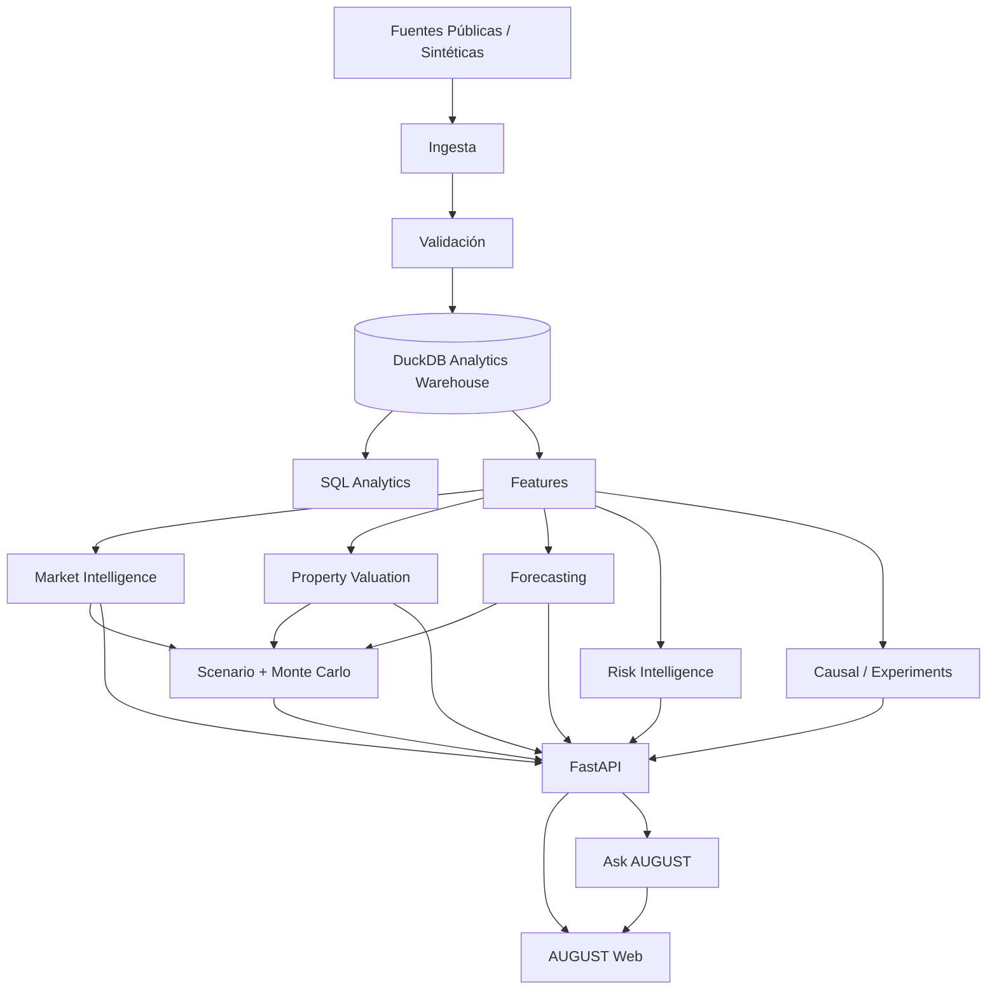

# AUGUST

## Decision Intelligence & Risk Engine

**De señales crudas a decisiones.**

[English](README.md) · [Español](README.es.md)


### FUENTES DE DATOS REALES · MODELOS · FORECASTING · FRAUDE · INFERENCIA CAUSAL · GENAI

---

> AUGUST es una plataforma open source de **Decision Intelligence** para inversión inmobiliaria, análisis de mercado, simulación de escenarios y riesgo. Está diseñada para responder una pregunta más difícil que “¿qué predice el modelo?”:
>
> **Dado todo lo que sabemos, ¿qué deberíamos hacer después y qué tan seguros estamos de esa decisión?**

**Demo en vivo:** aún no desplegada · **Reporte técnico:** [docs/SCIENTIFIC_RIGOR.md](docs/SCIENTIFIC_RIGOR.md) · **Model cards:** [model_cards/](model_cards/)

## Qué es AUGUST

AUGUST no es un dashboard genérico y tampoco es una colección de notebooks.

La primera superficie de producto es un sistema de decisión para real estate:

```text
PROPIEDAD
   ↓
CONTEXTO DE MERCADO
   ↓
VALOR JUSTO + RENTA + FORECAST
   ↓
INCERTIDUMBRE + RIESGO
   ↓
SCENARIO LAB
   ↓
EVIDENCIA PARA DECIDIR
   ↓
ASK AUGUST
```

La plataforma combina datos económicos, fundamentos de la propiedad, modelado estadístico, forecasting y simulación para que un analista pueda entender:

- **qué está cambiando;**
- **qué está impulsando el cambio;**
- **qué podría ocurrir después;**
- **qué tan incierta es la estimación;**
- **qué cambia bajo otro escenario económico;**
- **qué acción está respaldada por la evidencia.**

La capa posterior de Risk Intelligence extiende el mismo framework hacia fraude, riesgo transaccional, pérdida esperada y financiamiento.

## Superficies de producto

### 01 — Market

Un terminal de mercado para entender el entorno económico alrededor de una propiedad:

- inflación e inflación subyacente;
- tasa de referencia / tasas de interés;
- tipo de cambio MXN;
- empleo y actividad económica;
- indicadores de vivienda y renta;
- affordability;
- oferta / demanda;
- movimientos de precio reales frente a nominales.

El objetivo no es mostrar veinte gráficas. AUGUST presenta **primero la decisión** y después permite inspeccionar la evidencia.

### 02 — Analyze

El flujo central de análisis de propiedades:

```text
VALOR JUSTO
ESTIMACIÓN DE RENTA
POSICIÓN EN EL MERCADO
RETORNO AJUSTADO POR INFLACIÓN
PRESIÓN DE AFFORDABILITY
DISTRIBUCIÓN DEL FORECAST
RIESGO
CONFIANZA
¿POR QUÉ?
```

Cada conclusión debe poder rastrearse hasta los datos, el método, los supuestos y la incertidumbre.

### 03 — Scenario Lab

Un motor de simulación condicional.

Ejemplos:

```text
Inflación        +2 pp
Tasa hipotecaria +150 bps
MXN              -10%
Demanda de renta -15%
Oferta local     +20%
```

AUGUST recalcula entonces la valuación, el retorno esperado, los supuestos de demanda y la incertidumbre.

**Los resultados del Scenario Lab son simulaciones condicionales, no predicciones ciertas.**

### 04 — Ask AUGUST

La capa de lenguaje se ejecuta **después** del análisis determinístico.

El LLM no puede inventar el análisis. Primero se calculan las métricas estructuradas y las salidas de los modelos; la capa de lenguaje únicamente explica esos resultados y recupera definiciones, supuestos y model cards documentados.

## Arquitectura



## Política de datos

AUGUST sigue una estrategia **public-data first**.

| Dominio | Familia de fuentes | Estado |
|---|---|---|
| Macro México | INEGI | foundation del adapter |
| Tasas / FX | Banco de México SIE | foundation del adapter |
| Macro internacional | FRED | foundation del adapter |
| Renta de corto plazo | Inside Airbnb | contrato de pipeline |
| Geoespacial | datasets públicos / abiertos | contrato de pipeline |
| Fraude | datasets públicos anonimizados | fase posterior |
| Datos sensibles no disponibles | generadores sintéticos realistas | foundation implementada |

### Regla sobre datos sintéticos

Cuando no exista una fuente real y reproducible, AUGUST puede usar datos sintéticos **únicamente si están etiquetados explícitamente**.

El demo inicial utiliza datos sintéticos macroeconómicos e inmobiliarios para que cualquier ingeniero pueda ejecutar la plataforma desde el primer clon.

Nunca deben presentarse como performance observada del mercado.

## Principios científicos

Todo análisis serio en AUGUST debe responder:

1. ¿Cuál es la hipótesis o pregunta de decisión?
2. ¿Qué datos la respaldan?
3. ¿Qué supuestos se están haciendo?
4. ¿Contra qué baseline estamos comparando?
5. ¿Qué tan incierta es la estimación?
6. ¿Qué métrica evalúa el éxito?
7. ¿Qué podría invalidar la conclusión?

Reglas adicionales:

- una correlación nunca se describe como causalidad;
- los forecasts se evalúan con backtesting temporal;
- las predicciones incluyen incertidumbre cuando puede estimarse razonablemente;
- los datos sintéticos siempre se identifican;
- los modelos probabilísticos de clasificación se evalúan por calibración;
- los modelos de fraude optimizan costo de negocio, no únicamente métricas del clasificador;
- todo modelo incluye limitaciones y model card;
- toda explicación generada con IA debe estar sustentada en resultados estructurados.

Consulta [docs/SCIENTIFIC_RIGOR.md](docs/SCIENTIFIC_RIGOR.md).

## Implementación actual

El milestone foundation implementa código real para:

- contratos de decisión y provenance;
- generación determinística de demos sintéticos;
- ajuste por inflación y cálculo de retornos reales;
- baseline transparente de valuación inmobiliaria;
- simulación Monte Carlo para escenarios de propiedades;
- evaluación de forecasting con rolling-origin;
- primitives de anomaly detection;
- decisiones de fraude con expected loss y optimización de threshold;
- cálculo de tamaño de experimento / A/B de dos proporciones;
- baseline Difference-in-Differences;
- esquema DuckDB y analítica SQL;
- endpoints de producto con FastAPI;
- interfaz premium construida en Next.js;
- unit tests;
- Docker Compose;
- CI con GitHub Actions.

El repositorio deliberadamente **no afirma todavía performance de modelos en producción**.

## Resultados

No se publica ninguna métrica benchmark hasta que sea producida por un pipeline reproducible.

| Sistema | Métrica | Resultado público actual |
|---|---|---|
| Detección de fraude | PR-AUC | **Aún no reportado** |
| Detección de fraude | Recall @ review rate | **Aún no reportado** |
| Detección de fraude | Expected loss prevented | **Aún no reportado** |
| Forecasting | MAE / RMSE / MASE | **Aún no reportado** |
| Real estate | MAE / median APE | **Aún no reportado** |
| LLM | consistencia factual | **Aún no reportado** |
| LLM | hallucination rate | **Aún no reportado** |

Cuando se publiquen resultados, también deberán publicarse la versión exacta del dataset, la estrategia de split y el comando que los generó.

## Arquitectura del repositorio

```text
august/
├── apps/
│   └── web/                    # UI premium orientada a decisiones
├── api/                        # superficie de producto FastAPI
├── data/
│   ├── raw/
│   ├── external/
│   ├── processed/
│   └── synthetic/
├── ingestion/                  # adapters para fuentes públicas
├── sql/
│   ├── schema/
│   └── analytics/
├── notebooks/
│   ├── exploratory/
│   └── experiments/
├── src/august/
│   ├── core/
│   ├── econometrics/
│   ├── forecasting/
│   ├── real_estate/
│   ├── scenario/
│   ├── fraud/
│   ├── anomaly_detection/
│   ├── causal/
│   ├── experimentation/
│   ├── nlp/
│   ├── llm/
│   └── monitoring/
├── pipelines/
├── tests/
├── model_cards/
├── reports/
└── docs/
```

Los notebooks son para exploración. La lógica reutilizable pertenece en `src/`, y cualquier funcionalidad servida al producto debe estar detrás de interfaces probadas.

## Inicio rápido

### 1. Crear el entorno de Python

```bash
python -m venv .venv
source .venv/bin/activate
pip install -e ".[dev]"
```

### 2. Crear datos sintéticos determinísticos para el demo

```bash
python -m pipelines.bootstrap_demo
```

### 3. Iniciar la API

```bash
uvicorn api.main:app --reload --port 8000
```

### 4. Iniciar la aplicación web

```bash
cd apps/web
npm install
npm run dev
```

Abre `http://localhost:3000`.

La interfaz muestra una etiqueta visible **SYNTHETIC DEMO** hasta que se ingieran datos públicos reales.

También puedes iniciar el stack completo con:

```bash
docker compose up --build
```

## API

Endpoints iniciales:

```text
GET  /health
GET  /v1/market/pulse
POST /v1/properties/analyze
POST /v1/scenarios/simulate
POST /v1/risk/decision
POST /v1/ask
```

Ejemplo de request para una propiedad:

```json
{
  "city": "Monterrey",
  "neighborhood": "San Pedro",
  "asking_price_mxn": 6800000,
  "area_m2": 148,
  "bedrooms": 2,
  "bathrooms": 2
}
```

La respuesta incluye `data_classification`, provenance y supuestos para evitar que resultados del demo puedan confundirse con observaciones reales.

## Roadmap de módulos

### Market Intelligence
- pulso macroeconómico;
- valores reales frente a nominales;
- diagnósticos de estacionariedad y structural breaks;
- relaciones con lags / cross-correlations;
- relaciones multivariadas.

### Forecasting
Primero los baselines:
- naive;
- seasonal naive;
- exponential smoothing;
- ARIMA / SARIMA;
- gradient boosting / XGBoost / LightGBM cuando agreguen valor.

Evaluación:
- rolling-window backtesting;
- time-series cross-validation;
- MAE;
- RMSE;
- MASE;
- sMAPE;
- bias;
- interval coverage;
- error por horizonte.

### Real Estate Intelligence
- estimación de fair value;
- contexto de propiedades comparables;
- apreciación ajustada por inflación;
- real rental yield;
- affordability pressure;
- intervalos de incertidumbre;
- explainability.

### Risk Intelligence
- baseline de logistic regression;
- modelos tree / boosting;
- métodos de anomalías;
- calibración;
- PR-AUC;
- precision/recall @ review capacity;
- optimización de expected loss;
- explicaciones SHAP / locales;
- graph fraud analysis.

### Causal & Experimentation
- experimentos aleatorizados;
- power analysis;
- Difference-in-Differences;
- propensity methods;
- IPW;
- regression adjustment;
- documentación de sensibilidad y supuestos.

### GenAI Analyst
- analytics determinístico primero;
- modelo local / open-weight opcional;
- RAG sobre model cards, definiciones de métricas y documentación de datos;
- evaluación de factualidad y citas.

## Principio de producto

AUGUST no debería comunicar:

> “Conozco muchos algoritmos de machine learning.”

Debería comunicar:

> **Sé transformar un problema de negocio ambiguo en una pregunta medible, construir el sistema estadístico o de machine learning apropiado, evaluarlo rigurosamente, entender sus limitaciones, desplegarlo, monitorearlo y traducir el resultado en una decisión.**

## Disclaimer

AUGUST es un proyecto educativo y open source de Decision Intelligence. No proporciona asesoría financiera, de inversión, crédito o legal. Los datos de demo y las simulaciones no constituyen afirmaciones sobre propiedades o mercados reales.
