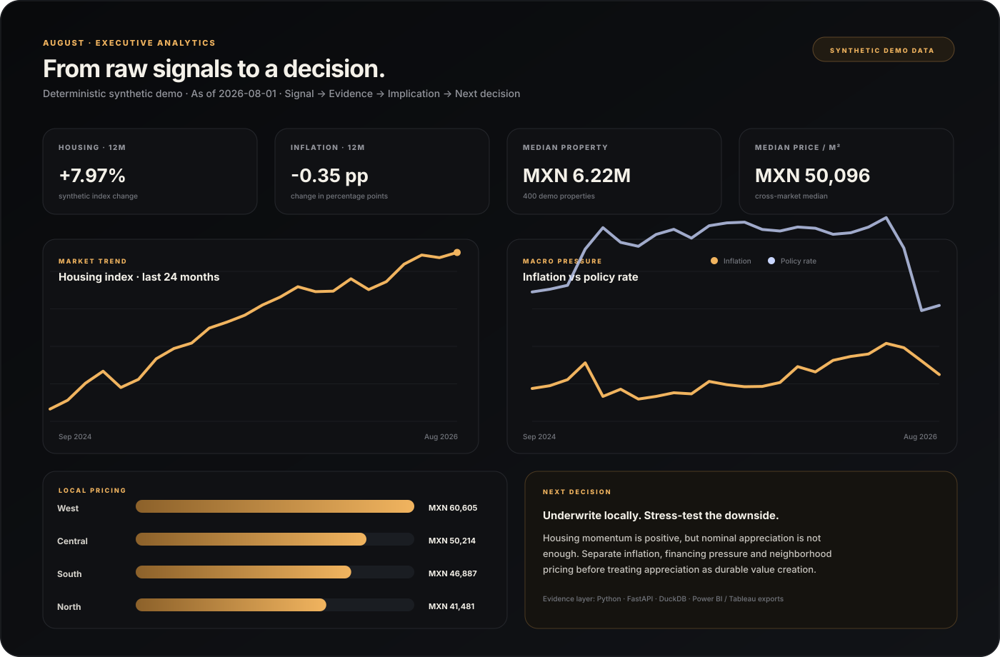
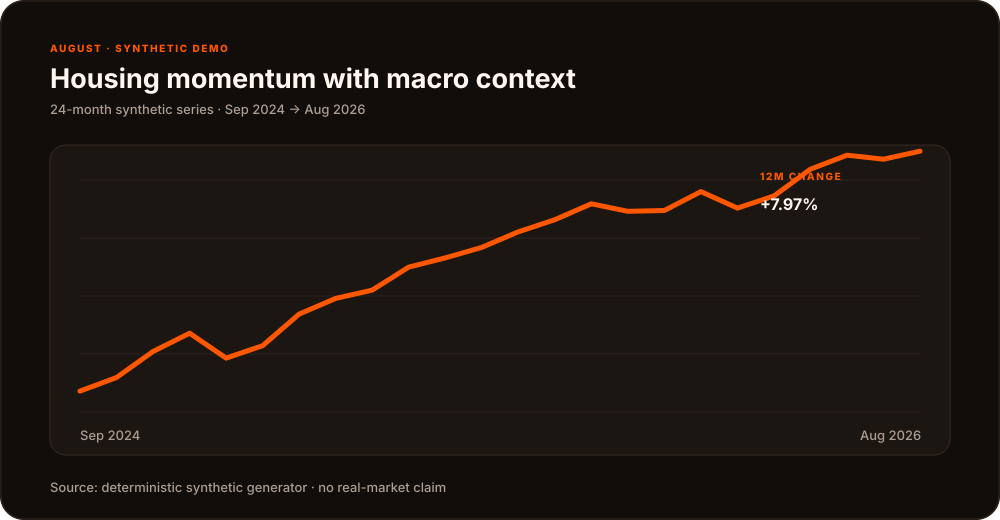
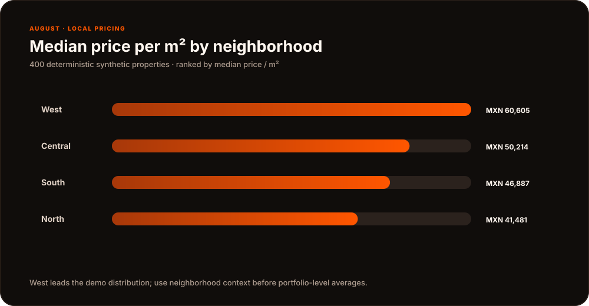
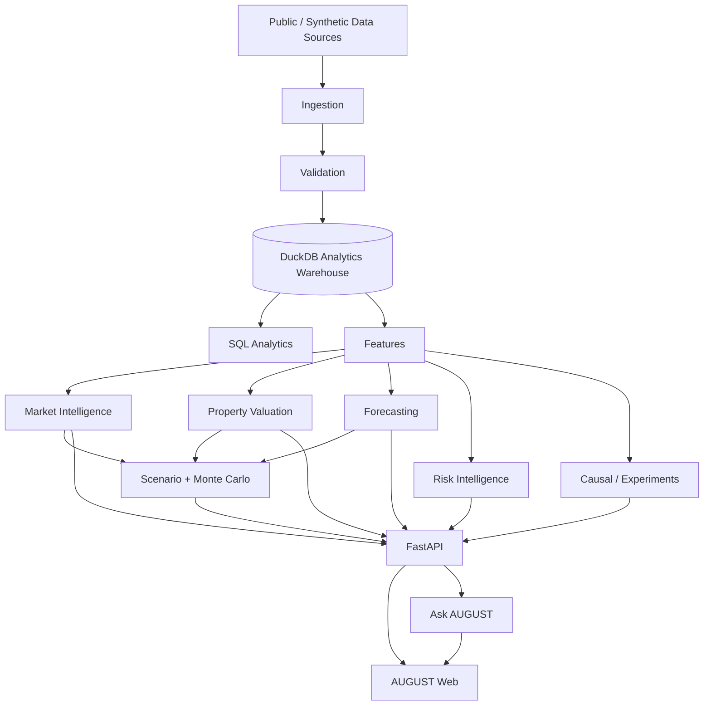

<p align="center">
  
</p>

<h1 align="center">AUGUST</h1>
<p align="center"><strong>Decision Intelligence &amp; Risk Engine</strong><br/><em>From raw signals to decisions.</em></p>
<p align="center"><a href="README.md">English</a> · <a href="README.es.md">Español</a></p>

<p align="center">
  
  
  
  
  
</p>

### REAL DATA SOURCES · MODELS · FORECASTING · FRAUD · CAUSAL INFERENCE · GENAI

---

> AUGUST is an open-source decision-intelligence platform for real-estate investment, market analysis, scenario simulation and risk. It is designed to answer a harder question than “what does the model predict?”:
>
> **Given everything we know, what should we do next — and how certain are we?**

**Live demo:** not deployed yet · **Executive analytics:** [reports/EXECUTIVE_DEMO_REPORT.md](reports/EXECUTIVE_DEMO_REPORT.md) · **BI workflow:** [docs/BI_STORYTELLING.md](docs/BI_STORYTELLING.md) · **Technical report:** [docs/SCIENTIFIC_RIGOR.md](docs/SCIENTIFIC_RIGOR.md) · **Model cards:** [model_cards/](model_cards/)

## Official AUGUST identity

The official brand uses vivid **AUGUST Orange `#FF5600`**, a white custom wordmark, and warm, dark product surfaces. Reuse the supplied assets rather than recreating the lettering:

- [Official wordmark](apps/web/public/august-wordmark.svg) — white vector lettering for orange or dark backgrounds.
- [AUGUST app icon](apps/web/public/august-icon.svg) — orange background with the signature white A.
- [README brand banner](docs/assets/august-brand-banner.svg) — official wordmark on the orange brand canvas.

The web app uses the same orange for primary actions, navigation, chart highlights and browser theme. Documentation visuals follow the same palette.

## Executive analytics — at a glance



<p align="center">
  
  
</p>

<sub>All values shown above come from AUGUST's deterministic synthetic demo (seed 42). They demonstrate the analytics, visualization and storytelling workflow and are not claims about a real market.</sub>

## What AUGUST is

AUGUST is not a generic dashboard and it is not a collection of notebooks.

The first product surface is a real-estate decision system:

```text
PROPERTY
   ↓
MARKET CONTEXT
   ↓
FAIR VALUE + RENT + FORECAST
   ↓
UNCERTAINTY + RISK
   ↓
SCENARIO LAB
   ↓
DECISION EVIDENCE
   ↓
ASK AUGUST
```

The platform combines economic data, property fundamentals, statistical modeling, forecasting and simulation so that an analyst can understand:

- **what is changing;**
- **what is driving the change;**
- **what may happen next;**
- **how uncertain the estimate is;**
- **what changes under a different economic scenario;**
- **which action is supported by the evidence.**

The later Risk Intelligence layer extends the same decision framework to fraud, transaction risk, expected loss and financing.

## Product surfaces

### 01 — Market

A market terminal for understanding the economic environment around a property:

- inflation and core inflation;
- policy / interest rates;
- MXN exchange rate;
- employment and economic activity;
- housing and rental indicators;
- affordability;
- supply / demand;
- real versus nominal price movements.

The point is not to display twenty charts. AUGUST surfaces the **decision first**, then lets the user inspect evidence.

### 02 — Analyze

The core property analysis flow:

```text
FAIR VALUE
RENT ESTIMATE
MARKET POSITION
INFLATION-ADJUSTED RETURN
AFFORDABILITY PRESSURE
FORECAST DISTRIBUTION
RISK
CONFIDENCE
WHY?
```

Every conclusion must be traceable to data, method, assumptions and uncertainty.

### 03 — Scenario Lab

A conditional simulation engine.

Examples:

```text
Inflation       +2 pp
Mortgage rate   +150 bps
MXN             -10%
Rental demand   -15%
Local supply    +20%
```

AUGUST then recomputes valuation, expected return, demand assumptions and uncertainty.

**Scenario outputs are conditional simulations — not certain predictions.**

### 04 — Ask AUGUST

The language layer sits **after** deterministic analytics.

The LLM is not allowed to invent analysis. Structured metrics and model outputs are computed first; the language layer only explains those outputs and retrieves documented definitions, assumptions and model cards.

## Architecture



## Data policy

AUGUST is **public-data first**.

| Domain | Source family | Status |
|---|---|---|
| Mexico macro | INEGI | adapter foundation |
| Rates / FX | Banco de México SIE | adapter foundation |
| International macro | FRED | adapter foundation |
| Short-term rental | Inside Airbnb | pipeline contract |
| Geospatial | public/open geospatial datasets | pipeline contract |
| Fraud | public anonymized fraud datasets | later phase |
| Missing sensitive data | realistic synthetic generators | implemented foundation |

### Synthetic data rule

When a real reproducible source is unavailable, AUGUST may use synthetic data **only if it is explicitly labeled**.

The starter demo uses synthetic property and macro data so a new engineer can run the platform immediately.

It must never be presented as measured market performance.

## Scientific principles

Every serious AUGUST analysis should answer:

1. What is the hypothesis or decision question?
2. What data supports it?
3. What assumptions are being made?
4. What baseline are we comparing against?
5. How uncertain is the estimate?
6. What metric evaluates success?
7. What could invalidate the conclusion?

Additional rules:

- correlation is never described as causation;
- forecasts are evaluated through temporal backtesting;
- predictions include uncertainty when it can reasonably be estimated;
- synthetic data is always identified;
- classification probability models are evaluated for calibration;
- fraud models optimize business cost, not only classifier metrics;
- every model gets limitations and a model card;
- every AI-generated explanation must be grounded in structured results.

Read [docs/SCIENTIFIC_RIGOR.md](docs/SCIENTIFIC_RIGOR.md).

## Portfolio evidence

AUGUST now demonstrates the communication layer that sits between modeling and a business decision:

- **Executive dashboard:** time-series charts, macro comparison, neighborhood ranking and KPI cards in the Next.js product.
- **Data storytelling:** every overview follows **Signal → Evidence → Implication → Next decision** instead of presenting charts without a conclusion.
- **Power BI / Tableau-ready data:** `python -m pipelines.export_bi` creates clean CSV facts, aggregates and KPI tables under `data/processed/bi/`.
- **Reproducible reporting:** `python -m pipelines.generate_executive_report` generates a written executive summary from the same analytical contract used by the API.
- **Single source of truth:** `build_executive_overview()` feeds the API, web dashboard, BI exports and report so metrics do not drift between surfaces.

See [BI + Data Storytelling](docs/BI_STORYTELLING.md) and the [executive demo report](reports/EXECUTIVE_DEMO_REPORT.md).

## Current implementation

The foundation milestone implements real code for:

- decision contracts and provenance;
- deterministic synthetic demo generation;
- inflation adjustment and real-return calculations;
- transparent baseline property valuation;
- Monte Carlo property scenario simulation;
- rolling-origin forecasting evaluation;
- anomaly detection primitives;
- fraud expected-loss decisions and threshold optimization;
- experiment sizing / two-proportion A/B analysis;
- Difference-in-Differences baseline;
- DuckDB schema and SQL analytics;
- FastAPI product endpoints;
- executive analytics + deterministic storytelling contract;
- Power BI / Tableau export pipeline;
- reproducible executive Markdown reporting;
- a premium Next.js product shell with native SVG charts;
- unit tests;
- Docker Compose;
- GitHub Actions CI.

The repository intentionally does **not** claim production model performance yet.

## Results

No benchmark number is published until it is produced by a reproducible pipeline.

| System | Metric | Current public result |
|---|---|---|
| Fraud detection | PR-AUC | **Not reported yet** |
| Fraud detection | Recall @ review rate | **Not reported yet** |
| Fraud detection | Expected loss prevented | **Not reported yet** |
| Forecasting | MAE / RMSE / MASE | **Not reported yet** |
| Real estate | MAE / median APE | **Not reported yet** |
| LLM | factual consistency | **Not reported yet** |
| LLM | hallucination rate | **Not reported yet** |

When these are reported, the exact dataset version, split strategy and command that generated them must also be published.

## Repository architecture

```text
august/
├── apps/
│   └── web/                    # premium decision UI
├── api/                        # FastAPI product surface
├── data/
│   ├── raw/
│   ├── external/
│   ├── processed/
│   └── synthetic/
├── ingestion/                  # public-source adapters
├── sql/
│   ├── schema/
│   └── analytics/
├── notebooks/
│   ├── exploratory/
│   └── experiments/
├── src/august/
│   ├── core/
│   ├── econometrics/
│   ├── forecasting/
│   ├── real_estate/
│   ├── scenario/
│   ├── fraud/
│   ├── anomaly_detection/
│   ├── causal/
│   ├── experimentation/
│   ├── nlp/
│   ├── llm/
│   └── monitoring/
├── pipelines/
├── tests/
├── model_cards/
├── reports/
└── docs/
```

Notebooks are for exploration. Reusable logic belongs in `src/`, and anything served to the product belongs behind tested interfaces.

## Quickstart

### 1. Create the Python environment

```bash
python -m venv .venv
source .venv/bin/activate
pip install -e ".[dev]"
```

### 2. Create deterministic synthetic demo data

```bash
python -m pipelines.bootstrap_demo
```

### 3. Start the API

```bash
uvicorn api.main:app --reload --port 8000
```

### 4. Start the web app

```bash
cd apps/web
npm install
npm run dev
```

Open `http://localhost:3000`.

The web UI displays a visible **SYNTHETIC DEMO** label until real public data is ingested.

Or start the complete stack:

```bash
docker compose up --build
```

## API

Initial endpoints:

```text
GET  /health
GET  /v1/market/pulse
GET  /v1/analytics/overview
POST /v1/properties/analyze
POST /v1/scenarios/simulate
POST /v1/risk/decision
POST /v1/ask
```

Example property request:

```json
{
  "city": "Monterrey",
  "neighborhood": "San Pedro",
  "asking_price_mxn": 6800000,
  "area_m2": 148,
  "bedrooms": 2,
  "bathrooms": 2
}
```

The response includes `data_classification`, provenance and assumptions so demo outputs cannot silently masquerade as real observations.

## Module roadmap

### Market Intelligence
- macroeconomic pulse;
- real vs nominal values;
- stationarity and structural-break diagnostics;
- lag relationships / cross-correlations;
- multivariate relationships.

### Forecasting
Baseline first:
- naive;
- seasonal naive;
- exponential smoothing;
- ARIMA / SARIMA;
- gradient boosting / XGBoost / LightGBM when they add value.

Evaluation:
- rolling-window backtesting;
- time-series cross-validation;
- MAE;
- RMSE;
- MASE;
- sMAPE;
- bias;
- interval coverage;
- horizon-specific error.

### Real Estate Intelligence
- fair-value estimation;
- comparable-property context;
- inflation-adjusted appreciation;
- real rental yield;
- affordability pressure;
- uncertainty intervals;
- explainability.

### Risk Intelligence
- logistic-regression baseline;
- tree/boosting models;
- anomaly methods;
- calibration;
- PR-AUC;
- precision/recall @ review capacity;
- expected-loss optimization;
- SHAP/local explanations;
- graph fraud analysis.

### Causal & Experimentation
- randomized experiments;
- power analysis;
- Difference-in-Differences;
- propensity methods;
- IPW;
- regression adjustment;
- sensitivity / assumptions documentation.

### GenAI Analyst
- deterministic analytics first;
- local/open-weight model optional;
- RAG over model cards, metric definitions and data documentation;
- factuality and citation evaluation.

## Product principle

AUGUST should not communicate:

> “I know a lot of machine-learning algorithms.”

It should communicate:

> **I know how to transform an ambiguous business problem into a measurable question, build the appropriate statistical or machine-learning system, evaluate it rigorously, understand its limitations, deploy it, monitor it and translate the result into a decision.**

## Disclaimer

AUGUST is an educational/open-source decision-intelligence project. It does not provide financial, investment, credit or legal advice. Demo data and simulations are not statements about actual properties or markets.
